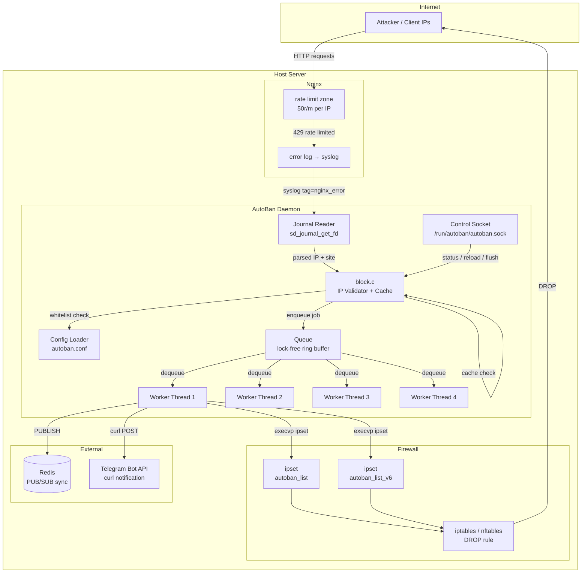
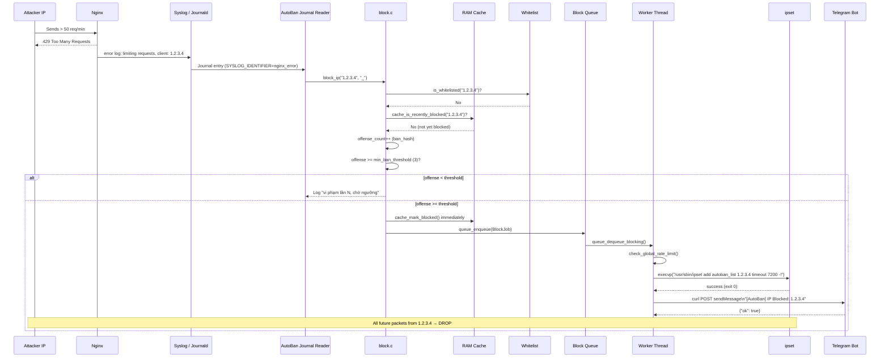
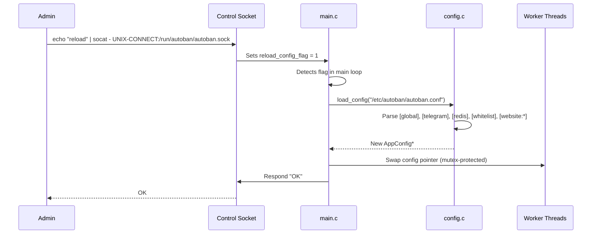
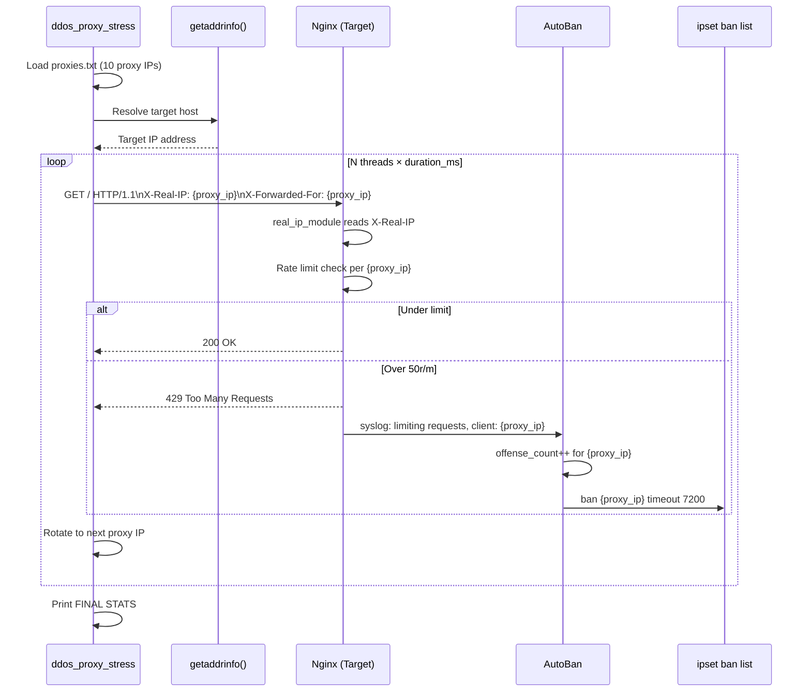
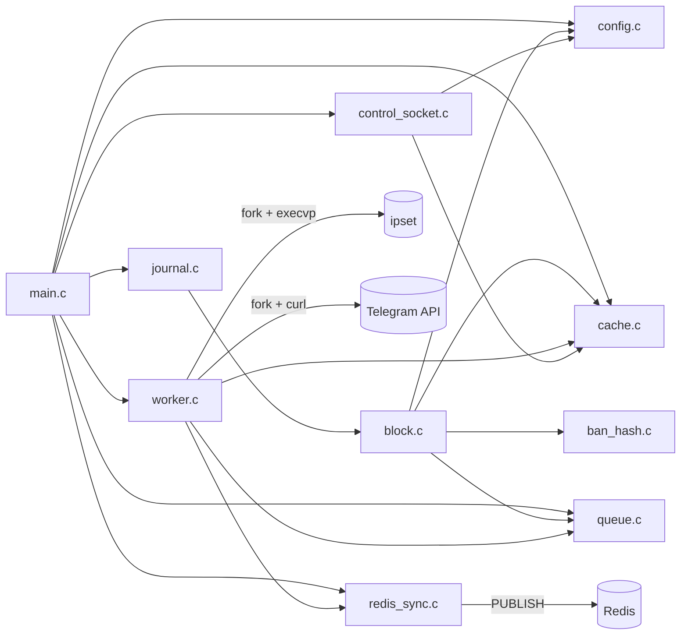

# AutoBan — Architecture & Sequence Diagrams

---

## 1. Overall System Architecture

---

## 2. Sequence Diagram — IP Ban Flow

---

## 3. Sequence Diagram — Reload Config

---

## 4. Sequence Diagram — DDoS Proxy Test Tool

---

## 5. Component Dependency Map

